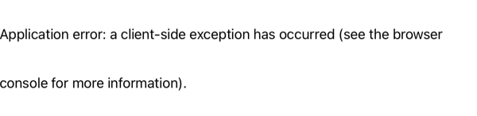

In this chapter we will create and apply access policies that will restrict access to services in Gloo Mesh Clusters and VM.

## Ensure Environment

Navigate to Tutorial home

```bash
cd $TUTORIAL_HOME
```

Set cluster environment variables

---8<--- "includes/env.md"

## Enable Global Access Policy

The Virtual Mesh that we crated in earlier as the `globalAccessPolicy` disabled, run the following command to verify the state of the same,

```bash
 kubectl --context="$MGMT" get virtualmeshes.networking.mesh.gloo.solo.io -n gloo-mesh bgc-virtual-mesh -o json | jq '.spec.globalAccessPolicy'
```

Now lets enable the `globalAccessPolicy` by running the following command,

```bash
$TUTORIAL_HOME/bin/17_toggle_mesh_access_policy.sh
```

As soon as the `globalAccessPolicy` is enabled you should see no traffic.

Now running the following command again should return a response **ENABLED**,

```bash
 kubectl --context="$MGMT" get virtualmeshes.networking.mesh.gloo.solo.io -n gloo-mesh bgc-virtual-mesh -o json | jq '.spec.globalAccessPolicy'
```

Lets verify if we are able to access the service,

```bash
$TUTORIAL_HOME/bin/call_bgc_service.sh "${CLUSTER1}"
```

The command should show an output like:

```text
RBAC: access denied
```

!!! note
    Refreshing the browser should also return `RBAC: acccess denied` as shown

    { align=center }

By default the moment we enable `globalAccessPolicy` the Gloo Mesh create allowNone with out any access policy associated with the resource, hence you the `RBAC: access denied` as output when calling the service.

## Enable Access

### Ingress Traffic via Istio

Let us now allow the traffic via Istio Ingress Gateway,

```bash
$TUTORIAL_HOME/bin/18_enable_access_via_ingress.sh
```

Let us try polling the service,

```bash
$TUTORIAL_HOME/bin/poll_bgc_service.sh "${CLUSTER1}"
```

The command should show the output from the service:

```bash
###################################################

Polling Service URL 35.244.63.221/api

###################################################
{
    "color": "blue",
    "count": 476,
    "greeting": "Namaste 🙏🏽",
    "pod": "blue-98db67777-797t7",
    "textColor": "whitesmoke",
    "userAgent": "HTTPie/2.5.0"
}


{
    "color": "blue",
    "count": 477,
    "greeting": "Namaste 🙏🏽",
    "pod": "blue-98db67777-797t7",
    "textColor": "whitesmoke",
    "userAgent": "HTTPie/2.5.0"
}


{== RBAC: access denied ==}


{
    "color": "green",
    "count": 2173,
    "greeting": "Bonjour 👋🏽",
    "pod": "green-7d9f5f4b47-rcb76",
    "textColor": "whitesmoke",
    "userAgent": "HTTPie/2.5.0"
}


{
    "color": "green",
    "count": 2174,
    "greeting": "Bonjour 👋🏽",
    "pod": "green-7d9f5f4b47-rcb76",
    "textColor": "whitesmoke",
    "userAgent": "HTTPie/2.5.0"
}
```

As you noticed the command shows one `RBAC: access denied`, that is from the VM Canary service.

!!!note
   If you are using the browser then you might see as shown, which is related to no Access to VM.
   { align=center }

Checking the Istio logs on the VM will show `rbac_access_denied_matched_policy`,

```bash
vagrant ssh -c "sudo tail -f /var/log/istio/istio.log"
```

```text
[2021-10-02T05:39:53.720Z] "GET /api HTTP/1.1" 403 - rbac_access_denied_matched_policy[none] - "-" 0 19 0 - "172.17.0.1" "Mozilla/5.0 (Macintosh; Intel Mac OS X 10_15_7) AppleWebKit/605.1.15 (KHTML, like Gecko) Version/15.0 Safari/605.1.15" "91dfed15-3288-469b-ad93-38a5a6af10f3" "34.93.158.36" "-" inbound|8080|| - 192.168.68.119:8080 172.17.0.1:0 outbound_.8080_.version-canary_.blue-green-canary.vm-blue-green-canary.svc.cluster.local -
```

### Allow Traffic to VM

What we did right now is allowing traffic from the Gloo Mesh Clusters and the traffic from and to vm is still blocked. Now let us now apply the Access policy that will allow the traffic to the VM,

```bash
$TUTORIAL_HOME/bin/19_enable_access_to_vm.sh
```

Let us try polling the service agian or you could refresh the browser,

```bash
$TUTORIAL_HOME/bin/poll_bgc_service.sh "${CLUSTER1}"
```

The command should now include the output from the *canary(VM)* version of service as well,

```bash
{
    "color": "green",
    "count": 2175,
    "greeting": "Bonjour 👋🏽",
    "pod": "green-7d9f5f4b47-rcb76",
    "textColor": "whitesmoke",
    "userAgent": "HTTPie/2.5.0"
}


{
    "color": "blue",
    "count": 478,
    "greeting": "Namaste 🙏🏽",
    "pod": "blue-98db67777-797t7",
    "textColor": "whitesmoke",
    "userAgent": "HTTPie/2.5.0"
}

...

{
    "color": "yellow",
    "count": 197,
    "greeting": "Hola ✋🏽",
    "pod": "vm-192.168.68.114",
    "textColor": "black",
    "userAgent": "HTTPie/2.5.0"
}
```

### Access service from VM

Let us now check if we are able to access the service from the VM,

```bash
vagrant ssh -c "http blue-green-canary.blue-green-canary.svc.cluster.local:8080/api"
```

As expected we got `RBAC: access denied` as we are yet to allow the traffic from the VM to the cluster,

```text
HTTP/1.1 403 Forbidden
content-length: 19
content-type: text/plain
date: Thu, 23 Sep 2021 16:29:22 GMT
server: envoy
x-envoy-upstream-service-time: 269

RBAC: access denied
```

Let us allow the VM to access the services on the Cluster,

```bash
$TUTORIAL_HOME/bin/20_enable_access_from_vm.sh
```

Now trying again to access the service from VM should show a successful response,

```bash
vagrant ssh -c "http blue-green-canary.blue-green-canary.svc.cluster.local:8080/api"
```

```text
HTTP/1.1 200 OK
content-length: 129
content-type: application/json; charset=utf-8
date: Thu, 23 Sep 2021 16:32:22 GMT
etag: "81-44uxFMXdXGKizzXNw4AXYnD7xj0"
server: envoy
vary: Accept-Encoding
x-envoy-upstream-service-time: 285

{
    "color": "yellow",
    "count": 198,
    "greeting": "Hola ✋🏽",
    "pod": "vm-192.168.68.114",
    "textColor": "black",
    "userAgent": "HTTPie/2.5.0"
}
```

Volià! We have successfully enabled the Access Policies on our Gloo Mesh cluster enabling traffic via Ingress to services on the Cluster and VM.

---8<--- "includes/abbrevations.md"
