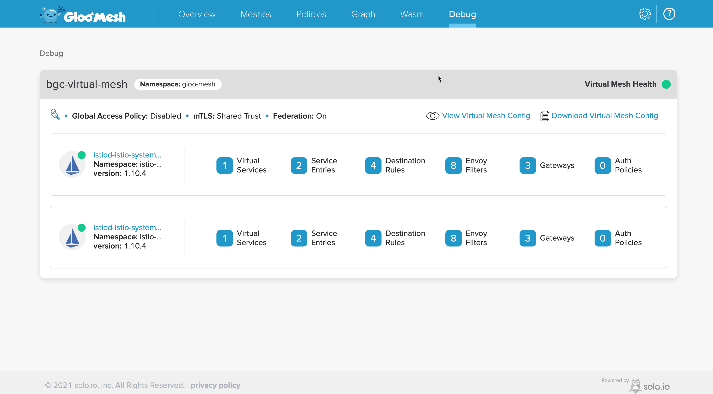

At the end of this chapter you would have,

- [x] Created Virtual Mesh to connect `$CLUSTER1(gke)` and `$CLUSTER1(eks)`
- [x] Applied Access Policies
- [x] Create TrafficPolicy to distribute traffic
- [x] Integrated VM Workload with Mesh

## Pre-requsites and Assumptions

This chapter assumes that you have done the following if not please vist the earlier chapters to compelte the requriements,

- [Setup VM](./env-setup.md#vm-setup)
- [Created Kubernetes Clusters on `$CLUSTER1(gke)`, `$CLUSTER1(eks)` and `$MGMT(civo)`](./env-setup.md#kubernetes-setup)
- [Deployed Istio on Workload Clusters](./env-setup.md#deploy-istio)
- [Installed Gloo Mesh and Registered the clusters](./env-setup.md#install-gloo-mesh)
- [Created VPN Tunnel in GCP](./site-to-site-vpn.md)

## Ensure environment

Navigate to Tutorial home

```bash
cd $TUTORIAL_HOME
```

Set cluster environment variables

---8<--- "includes/env.md"

## Enable PeerAuthentication

Let us configure Istio `PeerAuthentication` in `$CLUSTER1` and `$CLUSTER2`. `PeerAuthentication` enable the mTLS between service mesh services and will help in unifying the ROOT CA between heterogenous service meshes. This common ROOT CA enables the services across the meshes to trust each other.

### Cluster 1

```bash
kubectl --context=${CLUSTER1} apply -f $TUTORIAL_HOME/mesh-files/peer-auth.yaml
```

### Cluster 2

```bash
kubectl --context=${CLUSTER2} apply -f $TUTORIAL_HOME/mesh-files/peer-auth.yaml
```

## Virtual Mesh

Having enabled `mTLS` on `$CLUSTER1` and `$CLUSTER2`, we can now unify the service meshes using Gloo Mesh's *VirtualMesh*,

```bash
kubectl --context=${MGMT} apply -f $TUTORIAL_HOME/mesh-files/bgc-virtual-mesh.yaml
```

## Gloo Mesh Dashboard

We can use Gloo Mesh Dashboard to verify our registered clusters and mesh details,

Open a new terminal and run the following command,

```bash
source $TUTORIAL_HOME/.envrc
kubectl --context=$MGMT port-forward -n gloo-mesh  deployment/dashboard 8090:8090
```

You can then open the [dashboard](http://localhost:8090){_target=blank} in your browser which will open a page as shown:


If you navigate to the *Debug* tab you could see the `bgc-virtual-mesh` that we created with cluster1 and cluster2 Istio servicemeshes,



Now we are all set to deploy the demo applications on these clusters.

---8<--- "includes/abbrevations.md"
