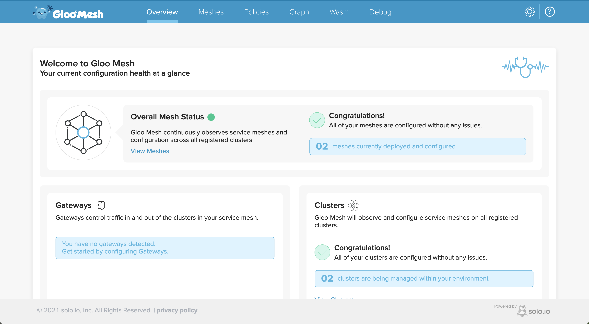

At the end of this chapter you would have,

- [x] Three Kubernetes Clusters on AWS,GCP and Civo
- [x] The VM on local environment
- [x] Installed Gloo Mesh Enterprise

## Kubernetes Cluster Setup

The demo requires us to have 3 Kubernetes clusters one that will act as Gloo Mesh Management and two as Workload clusters and other as pure workload cluster.

For this demo we will use three clouds,

{== TODO table with responsiblities ==}

1. AWS (Cluster-1)
2. GCP (Cluster-2)
3. CVIO (Management)

Copy the Ansible variable template file,

```bash
cp $TUTORIAL_HOME/vars.yml.example $TUTORIAL_HOME/vars.yml
```

Update the values of the file as per your environment

As the `vars.yml` will hold sensitive values please encrypt the file using the command

```bash
make encrypt-vars
```

## Workload VM Setup

We will use [Vagrant](http://vagrantup.com) to run and configure our workload VM. The terraform apply will create a file called `local_vpn_vars.yml` file in `$TUTORIAL_HOME/cloud/private`. Validate the values before running the command to generate the workload vm

```bash
make vm-up
```

Once the vm is up run the following command to setup create the cloud ressources,

### Create Kubernetes Clusters

```bash
make cloud-run
```

!!! note
  The step above will take approx 30-40 mins to complete

### Deploy Istio

We will deploy istio to all our workload clusters, in our setup AWS and GCP are workload clusters, run the following command to install the istio,

```bash
cd $TUTORIAL_HOME/work/mgmt
$TUTORIAL_HOME/bin/install_istio.sh
```

## Ensure Environment

Make sure you have the Gloo Mesh Gateway Enterprise License Key before proceeding to install. Export the license key to variable,

```shell
export GLOO_MESH_GATEWAY_LICENSE_KEY=<your Gloo Mesh Gateway EE License Key>
```

## Download meshctl

Download and install latest **meshctl** by running,

```shell
curl -sL https://run.solo.io/meshctl/install | sh
```

Add meshctl to the system path,

```shell
export PATH=$HOME/.gloo-mesh/bin:$PATH
```

Set cluster environment variables

---8<--- "includes/env.md"

Navigate to management work folder,

```bash
cd $TUTORIAL_HOME/work/mgmt
```

## Install Gloo Mesh Enterprise

Create the `gloo-mesh` namespace to install `Gloo Mesh`,

```bash
$TUTORIAL_HOME/bin/install_mesh.sh
```

!!! note
    - You can safely ignore the helm warnings
    - It will take few minutes for the Gloo Mesh to be installed and ready

Let us verify if all components are installed,

```bash
meshctl check server
```

```text
Gloo Mesh Management Cluster Installation
--------------------------------------------

🟢 Gloo Mesh Pods Status

🟡 Gloo Mesh Agents Connectivity
    Hints:
    * No registered clusters detected. To register a remote cluster that has a deployed Gloo Mesh agent, add a KubernetesCluster CR.
      For more info, see: https://docs.solo.io/gloo-mesh/latest/setup/cluster_registration/enterprise_cluster_registration/

Management Configuration
---------------------------
2021-09-14T06:41:10.594255Z     info    klog    apiextensions.k8s.io/v1beta1 CustomResourceDefinition is deprecated in v1.16+, unavailable in v1.22+; use apiextensions.k8s.io/v1 CustomResourceDefinition

🟢 Gloo Mesh CRD Versions

🟢 Gloo Mesh Networking Configuration Resources
```

## Cluster Registrations

To connect our hetregenous Isito clusters, we need to register them with the management cluster. The cluster registration will communicate with Management cluster via an `enterprise-agent`, we need to pass the enterprise-agent address as part of cluster registrations to enable effective communcation.

Register `$CLUSTER1` as `cluster1`:

```bash
$TUTORIAL_HOME/bin/1_register_cluster.sh $CLUSTER1 cluster1
```

Register `$CLUSTER2` as `cluster2`:

```bash
$TUTORIAL_HOME/bin/1_register_cluster.sh $CLUSTER2 cluster2
```

## Verify Install

Let us verify if all components are installed,

```bash
meshctl check server
```

```text
Gloo Mesh Management Cluster Installation
--------------------------------------------

🟢 Gloo Mesh Pods Status
+----------+------------+-------------------------------+-----------------+
| CLUSTER  | REGISTERED | DASHBOARDS AND AGENTS PULLING | AGENTS PUSHING  |
+----------+------------+-------------------------------+-----------------+
| cluster1 | true       |                             2 |               1 |
+----------+------------+-------------------------------+-----------------+
| cluster2 | true       |                             2 |               1 |
+----------+------------+-------------------------------+-----------------+

🟢 Gloo Mesh Agents Connectivity

Management Configuration
---------------------------
2021-09-14T04:56:04.288180Z     info    klog    apiextensions.k8s.io/v1beta1 CustomResourceDefinition is deprecated in v1.16+, unavailable in v1.22+; use apiextensions.k8s.io/v1 CustomResourceDefinition

🟢 Gloo Mesh CRD Versions

🟢 Gloo Mesh Networking Configuration Resources
```

## Mesh Dashboard

We will us the Gloo Mesh Dashboard to verify our registered clusters,

```bash
kubectl --context=$MGMT port-forward -n gloo-mesh  deployment/dashboard 8090:8090
```

You can then open the [dashboard](http://localhost:8090){_target=blank} in your browser which will open a page as shown:


