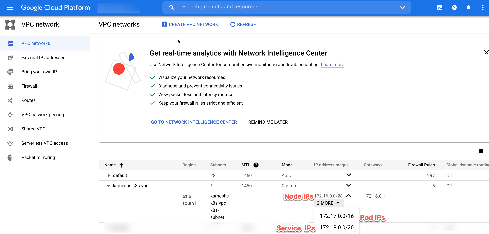

One of the main goals of this demo is to integrate VM on-premise with public cloud using Istio.  To be able to integrate the VM with Istio on the cloud we need to have networking done between public cloud and on-premise. There are many ways to do setup the networking for the demo sake we will have use [site-to-site VPN](https://cloud.google.com/network-connectivity/docs/vpn/concepts/overview){_target=blank} on GCP.

Let's take stock of our inventory,

- We have setup Kubernetes Clusters on AWS/Civo/GKE
- Installed Istio on to AWS/GKE clusters
- A linux VM provisioned via Vagrant.

At the end of this chapter we would have,

- [x] Created site-site VPN tunnel between GCP and your home network
- [x] Configured VM with IpSec service to tunnel traffic

## Demo Architecture

{align=center}

## Create VPN Resources

!!!important
    It is highly recommended that you have **static IP** that will connect your Home network to GCP. Dynamic IP will work but then it might require to VPN re-run the configuration every time the IP changes.

When we set the GKE we created the VPC and used it while setting up the GKE as a [VPC-native cluster](https://cloud.google.com/kubernetes-engine/docs/concepts/alias-ips){_target=blank}.

### IP Plan

The following section shows the IP plan of the GKE ,

---8<--- "includes/gke-cluster-ip-plan.md"

{align=center}

Running the following command will create the VPN on GCP and configure the site-to-site VPN using [strongswan](https:/strongswan.org){_target=blank} using IPSec.

```bash
make create-tunnel
```

The successful Gateway and Tunnel creation should show the following resources in the GCP console,

- Cloud VPN Tunnel

Cloud VPN Tunnel creates a VPN tunnel between your on-premise(home) network and Google Cloud. As you notice the tunnel's status is *First handshake* as we are yet to initate the connection from your VM which we will be doing in the next section.

{align=center}

- VPN Gateway

The VPN gateway helps routing the VPN traffic from our on-premise network into Google Cloud,

{align=center}

## Connect VM to Google Cloud

The setup done in the previous step would have enabled the `strongswan` systemd service on the vm let us check the status of the same,

Open a new terminal and ssh into the Vagrant vm

```bash
cd $TUTORIAL_HOME
```

All the commands in this chapter will be executed inside the VM, so lets SSH into it,

```bash
vagrant ssh
```

### IPSec Service

The `make create-tunnel` command would have enabled and started a systemd service called **strongswan**.  

Run the following command to check the status of the `strongswan` service,

```bash
sudo systemctl status strongswan
```

```bash
● strongswan.service - strongSwan IPsec IKEv1/IKEv2 daemon using swanctl
     Loaded: loaded (/lib/systemd/system/strongswan.service; enabled; vendor preset: enabled)
     Active: active (running) since Fri 2021-10-01 13:26:48 UTC; 2s ago
    Process: 63691 ExecStartPost=/usr/sbin/swanctl --load-all --noprompt (code=exited, status=0/SUCCESS)
   Main PID: 63658 (charon-systemd)
     Status: "charon-systemd running, strongSwan 5.8.2, Linux 5.4.0-88-generic, x86_64"
      Tasks: 17 (limit: 4682)
     Memory: 3.1M
     CGroup: /system.slice/strongswan.service
             └─63658 /usr/sbin/charon-systemd

Oct 01 13:26:50 ubuntu-focal charon-systemd[63658]: selected peer config 'gw-gw'
Oct 01 13:26:50 ubuntu-focal charon-systemd[63658]: authentication of 'xx.xxx.xx.xxx' with pre-shared key successful
Oct 01 13:26:50 ubuntu-focal charon-systemd[63658]: authentication of 'xx.xx.xxx.xx' (myself) with pre-shared key
Oct 01 13:26:50 ubuntu-focal charon-systemd[63658]: IKE_SA gw-gw[3] established between 192.168.68.119[xx.xx.xxx.xx]...xx.xxx.xx.xxx[xx.xxx.xx.xxx]
Oct 01 13:26:50 ubuntu-focal charon-systemd[63658]: scheduling reauthentication in 10593s
Oct 01 13:26:50 ubuntu-focal charon-systemd[63658]: maximum IKE_SA lifetime 11673s
Oct 01 13:26:50 ubuntu-focal charon-systemd[63658]: selected proposal: ESP:AES_GCM_16_256/NO_EXT_SEQ
Oct 01 13:26:50 ubuntu-focal charon-systemd[63658]: CHILD_SA home-gcp{2} established with SPIs ceb36c53_i c82d0bb7_o and TS 192.168.0.0/16 === 172.16.0.0/28 172.>
Oct 01 13:26:50 ubuntu-focal charon-systemd[63658]: generating IKE_AUTH response 1 [ IDr AUTH SA TSi TSr N(AUTH_LFT) ]
Oct 01 13:26:50 ubuntu-focal charon-systemd[63658]: sending packet: from 192.168.68.119[4500] to xx.xxx.xx.xxx[4500] (269 bytes)
```

The service status shows the connection has been successfully loaded, but not *established* yet.

### IPSec Service Configuration

The strongswan IPSec tunnel connection configuration done using the file `/etc/swanctl/conf.d/gcp-gloo-demos.conf`. For more details about the configuration please check the [strongswan docs](https://wiki.strongswan.org/projects/strongswan/wiki/Swanctlconf){_target=blank}.

```ApacheConf
connections {

   gw-gw {

    local_addrs  = 192.168.68.119
    remote_addrs = xx.xxx.xxx.xxx

    local {
      auth = psk
    }

    remote {
      auth = psk
    }

    children {

         home-gcp {
            local_ts  = 192.168.0.0/16
            remote_ts = 172.16.0.0/28,172.17.0.0/16,172.18.0.0/20
            rekey_time = 5400
            rekey_bytes = 500000000
            rekey_packets = 1000000
            esp_proposals = aes256gcm16-sha512-modp8192
            start_action = start
            dpd_action = restart
         }
    }

      version = 2
      mobike = no
      reauth_time = 10800
      proposals = aes256gcm16-sha512-modp4096

  }

}

secrets {
   ike-1 {
      id-1 = 192.168.68.119
      id-2 = xx.xxx.xxx.xxx
      secret = <Generated IPSec Secret>
   }
}
```

!!!important "Points to Ponder"

    - The `remote_ts` is mapped to the [GKE k8s subnets](./site-site-vpn.md#ip-plan) that we had defined for Nodes, Pods and Service respectively. This will enable the VM to route the traffic to those subnets via the VPN gateway and VPN tunnel

    - Its very important to have the Cipher[^1] *proposals* and *esp_proposals* inline with whats supported by GCP IKE Ciphers[^2]. 

    - Check the names `connections` --> *gw-gw* , `children` --> *home-gcp* and IKEV2[^3] `secret` --> *ike-1* from the `gcp-gloo-demos.conf` configuration to  their statuses from the `strongswan` service logs. For more detailed logs use `sudo journalctl -xe -u strongswan`

### Check Status

The status of tunnel can be checked on the VM using the `swanctl` utility,

```bash
sudo swantctl --list-sas
```

The command above lists the SA as shown,

```text
vagrant@ubuntu-focal:~$ sudo swanctl --list-sas
gw-gw: #3, ESTABLISHED, IKEv2, 63c3d5bc28f7d6eb_i a80e425a5246e759_r*
  local  'xx.xxx.xx.xx' @ 192.168.68.119[4500]
  remote 'xx.xxx.xx.xx' @ xx.xxx.xx.xx[4500]
  AES_GCM_16-256/PRF_HMAC_SHA2_512/MODP_4096
  established 194s ago, reauth in 9809s
  home-gcp: #2, reqid 1, INSTALLED, TUNNEL-in-UDP, ESP:AES_GCM_16-256
    installed 194s ago, rekeying in 4814s, expires in 5746s
    in  c23db81e,   1205 bytes,     6 packets,   119s ago
    out b4a96c26,    531 bytes,     8 packets,   119s ago
    local  192.168.0.0/16
    remote 172.16.0.0/28 172.17.0.0/16 172.18.0.0/20
```

When checking the Google Cloud Console it should show the VPN Tunnel status as *Established*,

{align=center}

### Check Connectivity

Let us check the connections between GKE and VM,

```bash
kubectl --context=gke apply -f $TUTORIAL_HOME/extras/checks-and-tests.yaml
```

Ping from the pod,

```bash
kubectl --context=gke exec -it $(kubectl --context=gke get pods -lapp=network-utils -ojsonpath='{.items[*].metadata.name}') -- ping <your VM public ip>
```

The ping should successfull with the output like,

```bash
# e.g kubectl --context=gke exec -it $(kubectl --context=gke get pods -lapp=network-utils -ojsonpath='{.items[*].metadata.name}') -- ping 192.168.68.119
PING 192.168.68.119 (192.168.68.119) 56(84) bytes of data.
64 bytes from 192.168.68.119: icmp_seq=1 ttl=62 time=32.6 ms
64 bytes from 192.168.68.119: icmp_seq=2 ttl=62 time=34.4 ms
64 bytes from 192.168.68.119: icmp_seq=3 ttl=62 time=117 ms
```

If tunnel was established successfully the following curl should return an HTML response as shown,

```bash
curl $(kubectl --context=gke get pods -lapp=nginx -ojsonpath='{.items[*].status.podIP}')
```

```html
<!DOCTYPE html>
<html>
<head>
<title>Welcome to nginx!</title>
<style>
html { color-scheme: light dark; }
body { width: 35em; margin: 0 auto;
font-family: Tahoma, Verdana, Arial, sans-serif; }
</style>
</head>
<body>
<h1>Welcome to nginx!</h1>
<p>If you see this page, the nginx web server is successfully installed and
working. Further configuration is required.</p>

<p>For online documentation and support please refer to
<a href="http://nginx.org/">nginx.org</a>.<br/>
Commercial support is available at
<a href="http://nginx.com/">nginx.com</a>.</p>

<p><em>Thank you for using nginx.</em></p>
</body>
</html>
```

!!!tip "When Tunnel is inactive"

    {align=center}

    The VPN tunnel goes inactive if there is no activity for sometime, whenever you see the Tunnel is inactive say you are not able to ping the Pods, try restarting the `strongswan` service and initiate the connection,

    ```bash
    vagrant ssh -c "sudo systemctl restart strongswan"
    ```

---8<--- "includes/abbrevations.md"

[^1]: https://wiki.strongswan.org/projects/strongswan/wiki/IKEv2CipherSuites
[^2]: https://cloud.google.com/network-connectivity/docs/vpn/concepts/supported-ike-ciphers
[^3]: https://en.wikipedia.org/wiki/Internet_Key_Exchange
