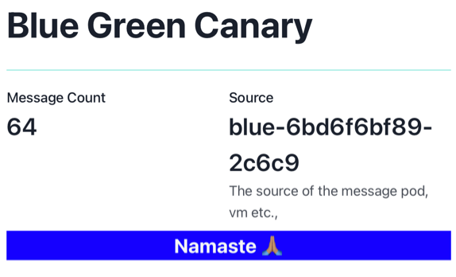
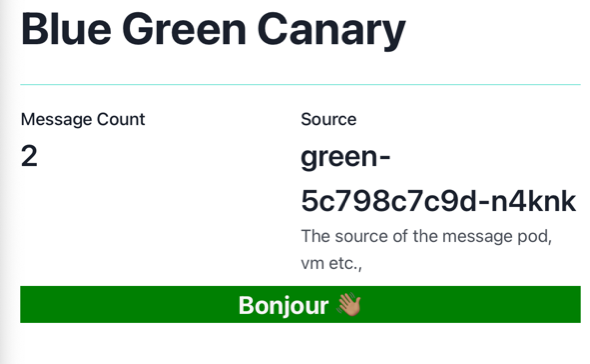
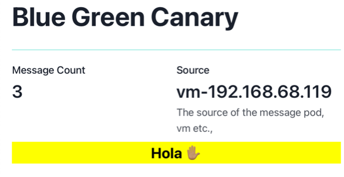

At the end of this chapter you would have,

- [x] Applied Access Policies
- [x] Create TrafficPolicy to distribute traffic
- [x] Integrated VM Workload with Mesh

## Ensure Environment

Navigate to Tutorial home

```bash
cd $TUTORIAL_HOME
```

Set cluster environment variables

---8<--- "includes/env.md"

## Delete Existing Test Gateway

As we will be configuring the services to use the Gloo Mesh `VirtualGateway` we will delete the existing Istio test gateways from both the workload clusterst,

```bash
kubectl --context="${CLUSTER1}" delete \
  -n blue-green-canary \
  -k "$TUTORIAL_HOME/demo-app/config/istio"
```

```bash
kubectl --context="${CLUSTER2}" delete \
  -n blue-green-canary \
  -k "$TUTORIAL_HOME/demo-app/config/istio"
```

Let us query the VirtualService(`vs`) and Gateways(`gw`) from the workload clusters and check our stocks,

```bash
kubectl --context="${CLUSTER1}" get vs,gw -n istio-system
```

```text
NAME                                           GATEWAYS             HOSTS                                       AGE
virtualservice.networking.istio.io/istiod-vs   ["istiod-gateway"]   ["istiod.istio-system.svc.cluster.local"]   35h

NAME                                                                               AGE
gateway.networking.istio.io/cross-network-gateway                                  35h
gateway.networking.istio.io/istio-ingressgateway-istio-system-cluster1-gloo-mesh   14h
gateway.networking.istio.io/istiod-gateway                                         35h
```

```bash
kubectl --context="${CLUSTER2}" get vs,gw -n istio-system
```

```text
NAME                                           GATEWAYS             HOSTS                                       AGE
virtualservice.networking.istio.io/istiod-vs   ["istiod-gateway"]   ["istiod.istio-system.svc.cluster.local"]   35h

NAME                                                                               AGE
gateway.networking.istio.io/cross-network-gateway                                  35h
gateway.networking.istio.io/istio-ingressgateway-istio-system-cluster2-gloo-mesh   14h
gateway.networking.istio.io/istiod-gateway                                         35h
```

## Gloo Mesh Gateway

Let us now create `VirtualGateway`, `VirtualHost` and  `RouteTable` to route to enable traffic routing to the `blue-green-canary` service across the `VirtualMesh`.

!!!note
    The `VirtualMesh` includes the on-premise VM

### Deploy Virtual Gateway

```bash
$TUTORIAL_HOME/bin/7_deploy_gateway.sh
```

Let us verify if `Gateway` and `VirtualService` are created on both the workload clusters,

#### CLUSTER1

```bash
kubectl --context=${CLUSTER1} get gw,vs -A 
```

```text
NAMESPACE      NAME                                                                               AGE
{==istio-system   gateway.networking.istio.io/bgc-virtualgateway-17072781039916753854 ==}               5s
istio-system   gateway.networking.istio.io/cross-network-gateway                                  35h
istio-system   gateway.networking.istio.io/istio-ingressgateway-istio-system-cluster1-gloo-mesh   14h
istio-system   gateway.networking.istio.io/istiod-gateway                                         35h

NAMESPACE      NAME                                                           GATEWAYS                                                   HOSTS                                       AGE
{==gloo-mesh      virtualservice.networking.istio.io/bgc-virtualhost-gloo-mesh   ["istio-system/bgc-virtualgateway-17072781039916753854"]   ["*"]==}                                       5s
istio-system   virtualservice.networking.istio.io/istiod-vs                   ["istiod-gateway"]                                         ["istiod.istio-system.svc.cluster.local"]   35h
```

#### CLUSTER2

```bash
kubectl --context=${CLUSTER2} get gw,vs -A 
```

```text
NAMESPACE      NAME                                                                               AGE
{==istio-system   gateway.networking.istio.io/bgc-virtualgateway-9692221184781295762   ==}              47s
istio-system   gateway.networking.istio.io/cross-network-gateway                                  35h
istio-system   gateway.networking.istio.io/istio-ingressgateway-istio-system-cluster2-gloo-mesh   14h
istio-system   gateway.networking.istio.io/istiod-gateway                                         35h

NAMESPACE      NAME                                                           GATEWAYS                                                  HOSTS                                       AGE
{==gloo-mesh      virtualservice.networking.istio.io/bgc-virtualhost-gloo-mesh   ["istio-system/bgc-virtualgateway-9692221184781295762"]   ["*"]==}                                       47s
istio-system   virtualservice.networking.istio.io/istiod-vs                   ["istiod-gateway"]                                        ["istiod.istio-system.svc.cluster.local"]   35h
```

## Calling Service

---8<--- "includes/call-service.md"

As you have observed the `blue-green-canary` service is by default configured to return the response from version `blue`.

## Traffic Policy

As we have unified the mesh we are good to distribute traffic amongst them. As part of the next section we will apply various traffic policies to distribute traffic amongst the `blue`, `green` and `canary` services.

Before we try the traffic shifting, open the service in the browser,

```bash
$TUTORIAL_HOME/bin/browse_bgc_service.sh "${CLUSTER1}"
```

{ align=center }

### Green

As we already have traffic sent to *blue*, let use try sending all the traffic to *green*

```bash
$TUTORIAL_HOME/bin/8_green.sh
```

Now if you try to call the service via browser or cli as [described](traffic.md#calling-service) it should return response from *green* service.

{ align=center }

### Canary

Let us now try sending all the traffic to *canary* service on the VM,

```bash
$TUTORIAL_HOME/bin/9_canary.sh
```

Now if you try to call the service via browser or cli as [described](traffic.md#calling-service) it should return response from *canary* service that is deployed in on-premise VM.

{ align=center }

### Blue <-- --> Green

Let's try to split the traffic between *blue*(`50%`) and *green*(`50%`),

```bash
$TUTORIAL_HOME/bin/11_blue-green.sh
```

If you try check your browser you should see an alternating blue-green traffic.

## Blue,Green and Canary

Finally let's try to split the traffic between *blue*(`40%`),*green*(`40%`) and *canary*(`20%`),

```bash
$TUTORIAL_HOME/bin/12_blue-green-canary.sh
```

If you try check your browser you should see almost equal traffic to *blue* and *green* and few requests to *canary*.

Now we checked the traffic distribution amongst revsions that are deployed on Istio clusters and VM. In the next chapter lets us apply access policies to restrict who and from where we can acess the service.

---8<--- "includes/abbrevations.md"
